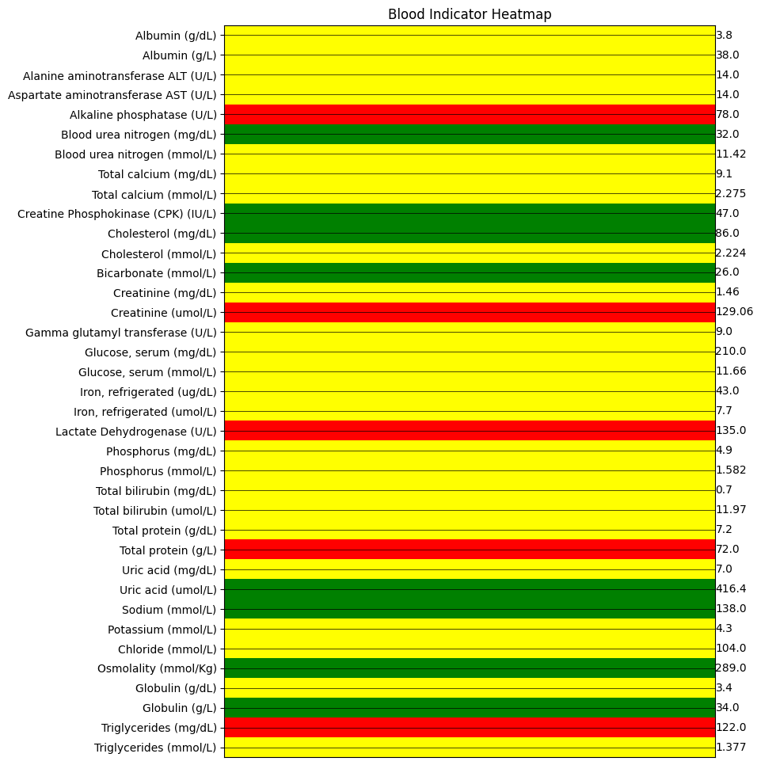

# DATAVIZ project

## Open this App with Github Codespaces

## The App

### JSON Rest API

The app provides raw json data or FHIR data via the routes:

- /patientID/raw/
- /patientID/fhir/
- /Blood_tests/raw/
- /Blood_tests/fhir/

### The HTML views

- / (Heatmap View from a specific blood test of a Patient)
- red = outside normal range
- yellow = extreme close to outside range
- green = normal range
  

