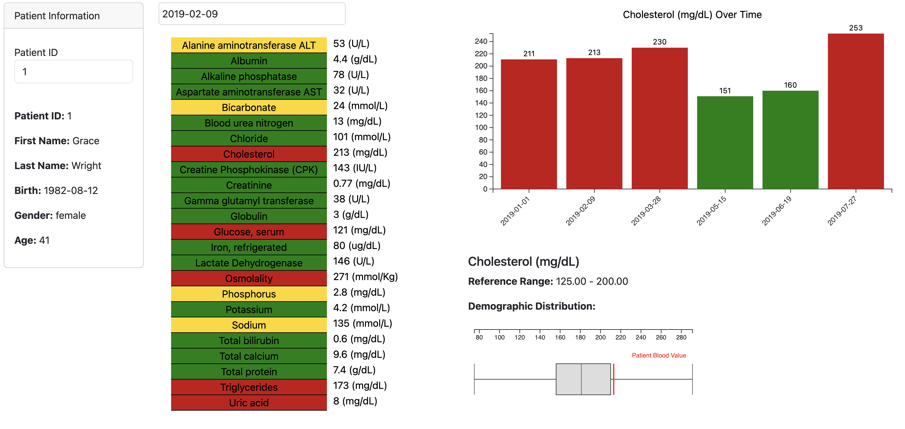

# The App

### JSON Rest API

The app provides raw json data via the routes:

- /<int:patientID>/raw   
- /all_blood_tests/raw/<int:patientID> 

The app provides FHIR data via the routes:

- /<int:patientID>/fhir'  

The app stores and reads post FHIR data via the routes: 

- /process_cmp  (read values from a comprehensive metabolic panel test encoded in FHIR)
- /fhir_bundle  (process a FHIR bundle containing patient resource and collection of blood observations resources)

The route still can only handle a single bundle at one time, so for storing multiple tests for the same patient the file should be run three times with different variables used.

For testing /fhir_bundle run the file test_fhir_bundle.py which contains 3 bundles for the same patient with three different blood test results. To test it just replace at the end of the code the line "response = requests.post(url, json=real_fhir_bundle_with_patient1)" with either real_fhir_bundle_with_patient1, real_fhir_bundle_with_patient2, real_fhir_bundle_with_patient3

### The HTML views

- / (Heatmap View from a specific blood test of a Patient)
- red = outside normal range
- yellow = close to outside range
- green = normal range
  

